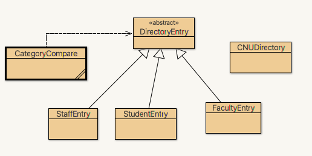

# Project 3

Years ago, CNU had a directory of all students, faculty and staff. You will replicate that for this assignment.
This assignment is **much** more open ended and larger
than previous assignments.

Please start early.

Read this entire README assignment prior to starting to code!

## The Directory

The CNU Directory lists Students, Faculty and Staff.
Each category/class has different information associated with it.

A [sample run](#samplerun) is at the end of this readme.


## Details about the code

You should write six different classes. Here is a UML diagram for the classes:



The dotted line indicates that CategoryCompare uses DirectoryEntry
(the other classes do as well, but I have not indicated that on the diagram).

The solid lines indicate inheritance.

The API for all classes except CNUDirectory is [here](https://www.pcs.cnu.edu/~lambert/Classes/CPSC255/P3/package-summary.html)

## Warning about reading input

**Use nextLine for reading all data in this program, not next.**

Addresses and names have whitespace within them

 `nextLine` reads in characters until a new line is reached.

`next` stops at the first whitespace.

**Mixing next and nextLine can produce surprising results.**

Do not do it.

You should only read from the keyboard (`Scanner(System.in)`) in CNUDirectory,
not any of the other classes, and you should have only one keyboard object.

### Subclasses

`StaffEntry`, `StudentEntry` and `FacultyEntry` have a constructor
and a `toString` method.
`StudentEntry` also has a 1 parameter constructor that is described in the [Edit](#edit) section.

### DirectoryEntry

`DirectoryEntry` should an abstract class.

### CategoryCompare

There are two major ways to compare values for collections (an ArrayList is a kind of collection, but there are many others). The first is compareTo in the Comparable interface. You should use that in the DirectoryEntry class. This should sort items alphabetically by last name. 

The second is compare in the `Comparator` Interface. The Comparator Interface requires the creation of a class. `Comparator` in general allows lists to be sorted in multiple ways. [Here](https://www.geeksforgeeks.org/comparator-interface-java) is an example of its use. Your assignment will only implement one way: by category (so all Faculty are listed first, then all Staff then all Staff). To use the Comparator interface create a class CategoryCompare that implements Comparator. Define compare to return an integer with the category (StudentEntry, FacultyEntry or StaffEntry) as the major sort key then last name then first name.

In your main method, create a CategoryCompare object (e.g., `CategoryCompare byCategory = new CategoryCompare();`). To sort using that object, use `Collections.sort(*yourArrayList*, *yourCategoryCompare object)`. For example if your ArrayList that holds your directory is name *cnu* and your CategoryCompare object is named `byCategory`, then to sort by category, you would write `Collections.sort(cnu, byCategory);`

### CNUDirectory

You should create a class with the main method called `CNUDirectory.java`.
There are no junit tests for this class.
You will only be tested on correct output, but will be graded on style also.  
This class should do the work of the program.
You should have a DirectoryEntry ArrayList that holds the directory.

This program is a loop that asks the user if they want to:
1. edit an item in the arraylist;
2. insert entries into the arraylist;
3. print the entries in the arraylist in alphabetic order (last name major, as specified in compareTo in DirectoryEntry).
4. print the entries in Category order (all Faculty then all Staff then all Students), as specified in compare in CategoryCompare.
5. quit.

You should have a method for each of these except quit which ends the program. Here is a description of each of the menu choices:

#### <a name="edit"></a>edit

`edit` is a bit of an overstatement:
There is only one thing that you are allowed to modify in the directory: you can toggle whether a student's address is shown.

So this method:
1. asks for the student's name.
2. creates a StudentEntry object using that name.
3. Checks to see if that object is in the arraylist
  * You can use the builtin `indexOf` for this, which will use your DirectoryEntry equals method). If not, return. If so, get the index of the first occurrence of the name (`indexOf` does this).
4. Toggle whether to include the address of the student when calling toString.
  * That is, if the addressShown is currently true, make it false, and the reverse.

#### insert

This method should add entries to the arraylist from keyboard input.

The method should
1. ask how many entries the user wants to enter.
2. for each entry:
  a. read in the kind of entry is being insert (Student, Faculty, Staff)
  b. read in  the name and address
  c. read in the other information appropriate for the class (dorm and major for students, etc.)
  d. create a new object, and insert it at the end of the arraylist
  e. get the next entry

#### print the directory alphabetically

To sort all elements using the toCompare in DirectoryEntry, which sorts elements by last name then first name then category/class (Faculty then Staff then Student), use Collections.sort(*arraylistname*).

#### print the directory by Category (all faculty then all staff then all students)

To sort all elements by category, use an object of CategoryCompare as the second parameter in Collections.sort.

Here is an example:

```java
CategoryCompare byCategory = new CategoryCompare();
Collections.sort(cnu, byCategory);
```


## Redirection

You will be entering a lot of data to test this program.
It would be nice to use files for this, but we have not covered them yet.
There is a way, however, to read data from a file as
though you were reading from the keyboard.
That is called redirection.
To run a program on the command line, go to the bin directory,
and type `java Program`
* That is replace `Program` with the ClassName to run;
* The  main program will be CNUDirectory, but you may  have main programs in the other classes to test them).
* If you want to read input from a file instead of the keyboard, use the less than symbol: `java Program < infile.txt`

To redirect output that would normally go to the screen use the greater than symbol.
Here is a sample.

Consider this code:

```java
public class ReadTwo
{
    public static void main(String[] args)
    {
        java.util.Scanner kbd = new java.util.Scanner(System.in); // or use import
        int n1, n2;
        System.out.print("Enter two numbers-> ");
        n1 = kbd.nextInt();
        n2 = kbd.nextInt();
        System.out
            .println("The sum of " + n1 + " and " + n2 + " is " + (n1 + n2));
    }
}
```

Here is a sample run of ReadTwo.java:

```
> java ReadTwo
Enter two numbers-> 6 8
The sum of 6 and 8 is 14
```

If we create a file `in.txt` that has the `6 8` in it, to redirect the input and output to a file named out.txt, you could do the following: `java ReadTwo < in.txt > out.txt` at a prompt.
You would then see another prompt because the program has run,
reading everything from the keyboard,
and redirecting everything to the output file.
The output file now looks like:

 `Enter two numbers-> The sum of 6 and 8 is 14`.
 
 That is, everything that would have gone to the screen now goes to
 the file (except errors, which would still be printed to the screen).
 The prompt is now is distracting and not helpful.

Because **you should use redirection on this program**,
the program that you turn in should not have prompts.
I recommend that you use them as you are testing small inputs,
but then comment them out.
Your repo has `ReadTwo.java` for redirection practice.
It is not related to the rest of the project.

## <a name="samplerun"></a>Sample Run

Below is the output file from this input file.
Comments  marked with `//` are not in the files.

### input.txt

```
I           // go to insert mode
1           // user wants to enter one item
STUDENT     // the category can be mixed case. assume all input is well formatted
Emma Olivia // name Emma will be come first, Olivia, last
45 Vale Drive Brainerd, MN 56401 // address will be on one line
York River  // students have dorms and majors
Biology
C           // print the entire directory by category
I           // insert more items
2           // 2 more
Faculty
Ava Isabella
280 Blackburn Ave. Ridgewood, NJ 07450
Luter 101       // faculty have offices and departments
African-American Studies
Student         // list each entry one after the other
Sophia Charlotte
750 Schoolhouse Ave. Bloomfield, NJ 07003
Santoro
Communication Studies
E            // edit Emma Olivia. Her address was showing; now, it won't be
Emma Olivia  // enter the name.
E            // edit Randall Munroe. because he is not a student, nothing changes.
Randall Munroe
A            // print the list by last name independent of category ( so Charlotte then Isabella then Olivia)
Q
```

### output file if input is redirected.

<pre>
**Students** // This is the result of C above. For each category that has entries, print a title

Name:     Emma Olivia                // the entries themselves do not have "student" as they do below
	Address: 45 Vale Drive Brainerd, MN 56401 // print student's home address
	York River
	Major:    Biology
Student: Name:   Sophia Charlotte    // this begins the alph listing. Each entry has the category of the entry
	Address: 750 Schoolhouse Ave. Bloomfield, NJ 07003
	Santoro
	Major:    Communication Studies
Faculty: Name:      Ava Isabella     // faculty are interweaved with students. The list is A-Z last, first, category
	Office:    Luter  101
	Department: African-American Studies
Student: Name:     Emma Olivia       // emma's address it not printed this time.
	York River
	Major:    Biology
</pre>

## Longer sample run

For this [longer input file](https://www.pcs.cnu.edu/~lambert/Classes/CPSC255/P3/biginput.txt), you should produce this [output file](https://www.pcs.cnu.edu/~lambert/Classes/CPSC255/P3/bigoutput.txt).

## Partners

For this  project, you may choose to have a programming partner or not.
If you do, I recommend that you choose one repo as the working repository.

Do your pushes to that repository only.

If you and partner agree to work together, then one of you Email me your partners name
 and be sure to cc (carbon copy) your partner on the email.

Each time you work on the program,
*git pull* it from that repository, then *git push* your changes when you
are done.  Your partner then *git pull*, edit, *git push*, and the cycle repeats.
You must work together and coordinate your pushes and pulls.

Partners should show a comparable amount of git commits with meaningful comments.

One partner maintain the repo, should add the other
partner as a "developer" under this project (*not the group*)!

## Suggestions

Carefully workout the logic design first.

Then, write one method per day and test.
If you come for help, we will ask to see your flowchart, so make sure
that you start with that.

As you write each method, make sure your methods pass all unit tests.

**Push your changes at the end of every session.**

## Progress

You should make significant progress on the project early on.
10 points of the program will be consistent, significant pushes
(at least one working method at least 2 times/week).

## Due Date

* `DirectoryEntry.java` is due March 15 at 11:59pm.
* `StudentEntry.java`, `FacultyEntry.java` and `StaffEntry.java` is due March 20  at 11:59pm.
* The entire project is due March 27 at 11:59.

All submissions are to GitLab/WebCAT.  
Make sure that your tests pass on WebCat and that you
use proper style as graded by WebCat.

I have added some bonus points for early submission;
your last submission before due date counts for grade.

> NOTE: After early due dates, the WebCAT submitter for that portion will fail.
> That is expected.

I will clone your repository and manually grade portions of the code.

## Rubric  (150 points total)
 
 * Milestone 1 (WebCAT DirectoryEntry) - 15 points 
 * Milestone 2 (WebCAT 25 points correctness + 5 points style)
   * DirectoryEntry, StaffEntry, StudentEntry, and FacultyEntry by tests
   * 5 points style
 * Milestone 3 (WebCAT final) - 45 points
   * DirectoryEntry, StaffEntry, StudentEntry, and FacultyEntry by tests
   * CategoryCompare.
   * 5 points style
 * Code Quality ( 20 points instructor review)
 * CNUDirectory functionality and overall program   ( 30 points instructor review)
 * Git usage    ( 10 points - reasonable git log, with both partners committing)
